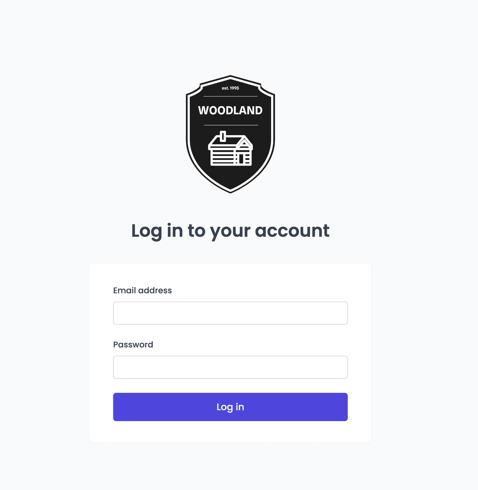
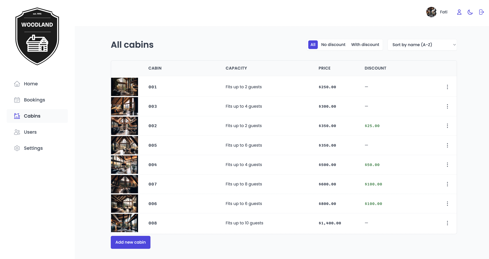
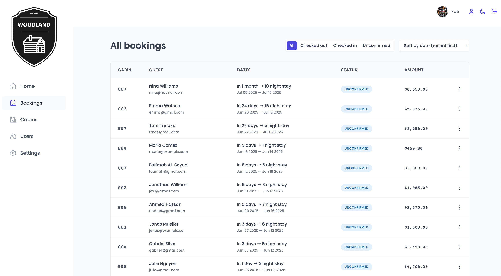
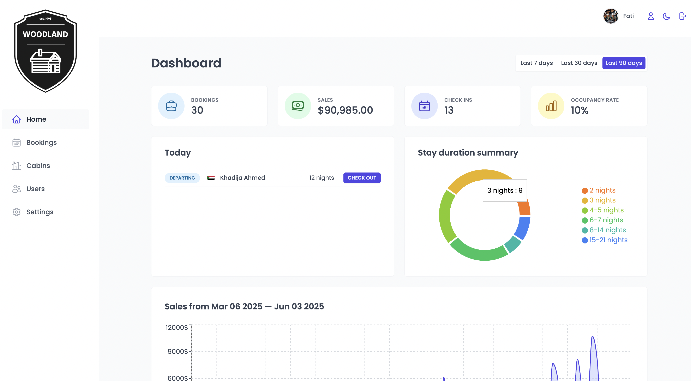
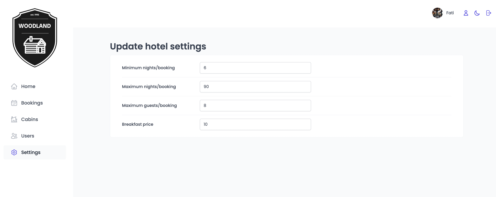
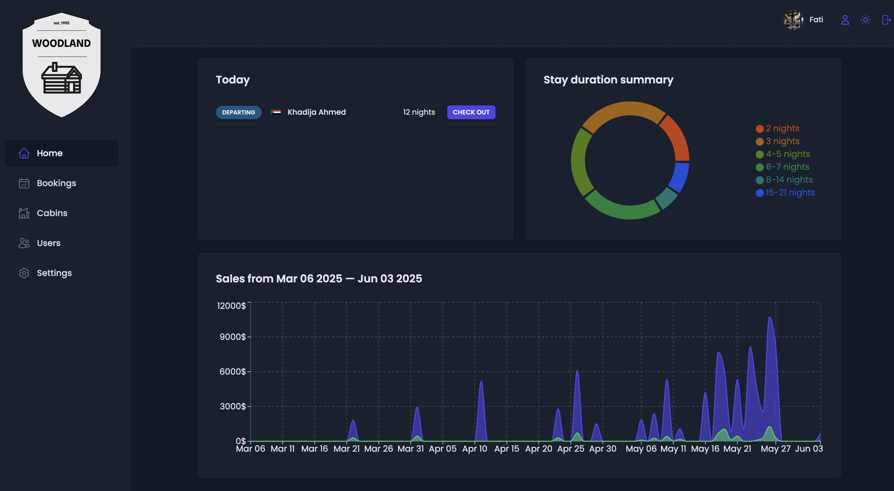

# 🌲 Woodland

**Woodland** is a custom-built internal management application for a small boutique hotel with 8 luxurious wooden cabins. This React + Vite + TypeScript SPA enables hotel staff to manage bookings, guests, cabins, and internal settings through a user-friendly interface.

> This is an internal app used only by hotel employees. Account creation is restricted to ensure access control.

---

## 📦 Tech Stack

- **Frontend**

  - [React](https://reactjs.org/) with [Vite](https://vitejs.dev/)
  - [TypeScript](https://www.typescriptlang.org/)
  - [React Router](https://reactrouter.com/) – Routing
  - [styled-components](https://styled-components.com/) – Scoped CSS-in-JS
  - [React Hook Form](https://react-hook-form.com/) – Form management
  - [React Query](https://tanstack.com/query) – Remote state & caching
  - [React Icons](https://react-icons.github.io/react-icons/)
  - [React Hot Toast](https://react-hot-toast.com/) – Notifications
  - [Recharts](https://recharts.org/) – Charts & data viz
  - [date-fns](https://date-fns.org/) – Date utilities

---

## 🌐 Live Demo

You can check out the deployed version of the app here:  
👉 [woodlandbooking.netlify.app](https://woodlandbooking.netlify.app)  

> Note: This is an internal tool — login is restricted to authorized users.

---

- **State Management**

  - React Query for async data
  - Context API with `useState` for UI state

- **Backend**
  - [Supabase](https://supabase.io/) – Auth, DB, and storage

---

## 📋 Key Features

### 🔐 User Authentication & Management

  

- Secure login system via Supabase
- Employees can upload avatars, and update their name and password
- Account creation only possible internally

---

### 🛏️ Cabins Management

  

- Table view of all cabins with:
  - Photo, name, capacity, price, discount
- Create, update, delete cabins with photo upload support

---

### 📆 Bookings Management

  

- View all bookings: arrival/departure dates, status, paid amount
- Booking status filters: `unconfirmed`, `checked in`, `checked out`
- Check in/out guests & confirm payment
- Add breakfast during check-in if not previously added

---

### 📊 Dashboard

  

- Daily check-in/out actions
- Key metrics: bookings, check-ins, revenue, occupancy
- Stay duration statistics
- Sales charts: total vs extras (breakfast)

---

### ⚙️ Settings

  

- Define app-wide settings:
  - Breakfast price
  - Min/max nights per booking
  - Max guests per booking
- Dark mode toggle:

  

